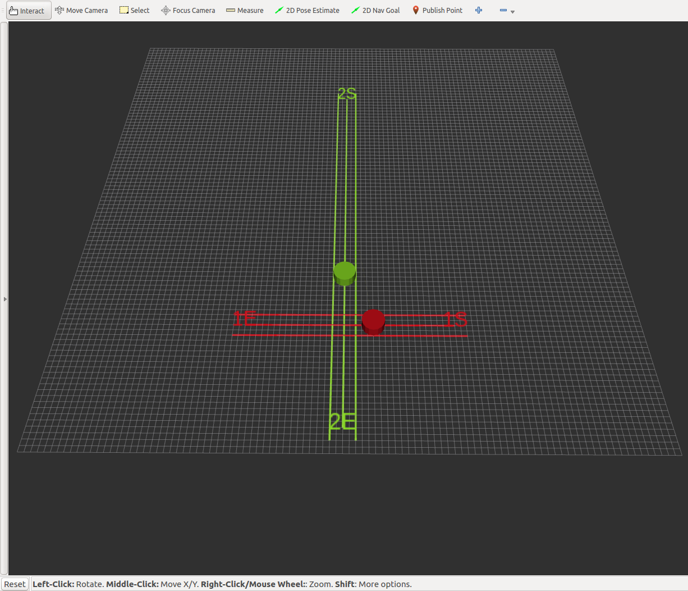

# SelforganizedMultiRobotTaskPlanning
Prototypische Implementierung einer selbstorganisierten Verteilung und Ausführung von Transportaufträgen in einem Multi-Roboter-System für die von der HTW Saar entwickelten Transportroboter des EmRoLab. Die Roboter planen bei der Verteilung von Transportaufgaben selbstständig, wer welchen Transportauftrag ausführen soll. Diese Verteilung kann nach gefahrener Distanz oder paralleler Ausführungszeit optimiert werden. Bei der Ausführung der Transportaufträge koordinieren sich die Roboter, sodass keine Kollisionen zwischen den Robotern entstehen. 

Im Ordner [staticTaskAllocation](https://github.com/htw-saar-informatik/SelforganizedMultiRobotTaskPlanning/tree/master/staticTaskAllocation) findet sich ein Prototyp für eine statische Auftragsverteilung, bei der die Aufteilung der Transportaufträge von einem zentralen Planer vor der Auftragsausführung durchgeführt wird.
Im Ordner [autonomous_robot](https://github.com/htw-saar-informatik/SelforganizedMultiRobotTaskPlanning/tree/master/autonomous_robot "autonomous_robot") findet sich ein Prototyp für eine dynamische Auftragsverteilung, bei der Aufträge von den Robotern während der Ausführung der Roboter verteilt werden.

Die Prototypen wurden im Rahmen der Masterthesis von Markus Altmeyer ([maltmeyer](https://github.com/maltmeyer)) an der Hochschule für Technik und Wirtschaft des Saarlandes ([htw saar](https://www.htwsaar.de/))  entwickelt.

---
Prototypical implementation for a selforganized task allocation and task execution of transport tasks in a multi robot system for transport robots of the EmRoLab by the HTW Saar. Distribution of transport tasks is done autonomously by the robots. Distribution can be optimized for distance or parallel execution time. Coordination for task execution is done by the robots to ensure that no collision occurs.

A prototype for static task allocation can be found at [staticTaskAllocation](https://github.com/htw-saar-informatik/SelforganizedMultiRobotTaskPlanning/tree/master/staticTaskAllocation). This prototype uses a static task allocation, where the tasks are distributed by a central planner before the task execution starts.
A prototype for dynamic task allocation, where task distributen is done while the robots execute the tasks, can be found at [autonomous_robot](https://github.com/htw-saar-informatik/SelforganizedMultiRobotTaskPlanning/tree/master/autonomous_robot "autonomous_robot").

The prototypes were developed as a part of the master thesis of Markus Altmeyer ([maltmeyer](https://github.com/maltmeyer)) at the University of Applied Sciences in Saarbrücken ([htw saar](https://www.htwsaar.de/en)).

*Simulation der Auftragsausführung der Roboter / Task execution simulation of robots*